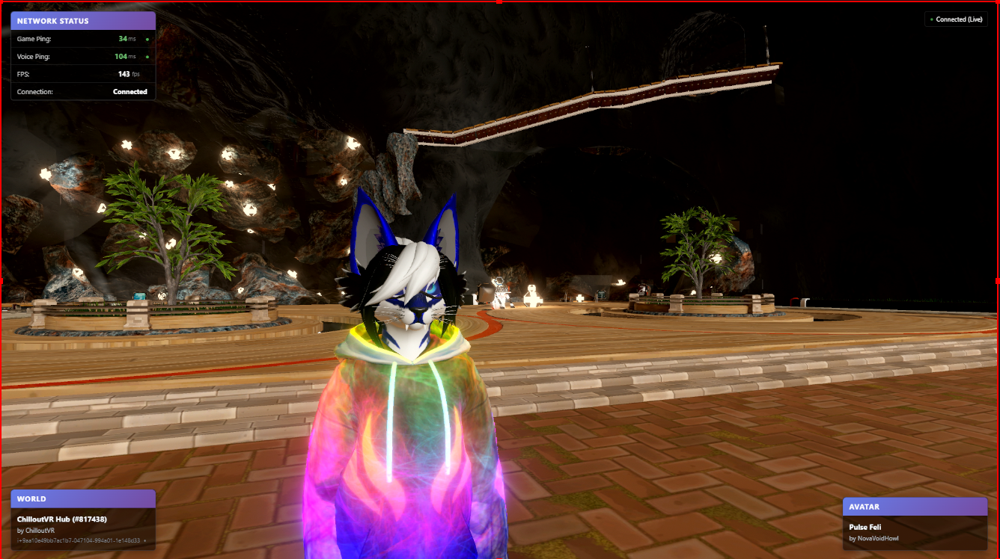

<!-- Improved compatibility of back to top link: See: https://github.com/othneildrew/Best-README-Template/pull/73 -->

<a name="readme-top"></a>

<!-- PROJECT SHIELDS -->

<!--
*** I'm using markdown "reference style" links for readability.
*** Reference links are enclosed in brackets [ ] instead of parentheses ( ).
*** See the bottom of this document for the declaration of the reference variables
*** for contributors-url, forks-url, etc. This is an optional, concise syntax you may use.
*** https://www.markdownguide.org/basic-syntax/#reference-style-links
-->

[![Contributors][contributors-shield]][contributors-url]
[![Forks][forks-shield]][forks-url]
[![Stargazers][stars-shield]][stars-url]
[![Issues][issues-shield]][issues-url]
[![MIT License][license-shield]][license-url]

<!-- PROJECT LOGO -->

<br />
<div align="center">
  <h3 align="center">CVR Data Feed OBS Overlay</h3>

  <p align="center">
    A real-time overlay for OBS Studio that displays ChilloutVR world, avatar, and network information from the
    DataFeed mod.
    <br />
    <a href="https://github.com/NovaVoidHowl/CVR-DataFeed-OBS-Overlay/issues">Report Bug</a>
    ·
    <a href="https://github.com/NovaVoidHowl/CVR-DataFeed-OBS-Overlay/issues">Request Feature</a>
  </p>
</div>

<!-- TABLE OF CONTENTS -->

<details>
  <summary>Table of Contents</summary>
  <ol>
    <li>
      <a href="#about-the-project">About The Project</a>
      <ul>
        <li><a href="#features">Features</a></li>
        <li><a href="#technology-stack">Technology Stack</a></li>
      </ul>
    </li>
    <li>
      <a href="#getting-started">Getting Started</a>
      <ul>
        <li><a href="#prerequisites">Prerequisites</a></li>
        <li><a href="#installation">Installation</a></li>
        <li><a href="#configuration">Configuration</a></li>
        <li><a href="#obs-studio-setup">OBS Studio Setup</a></li>
      </ul>
    </li>
    <li>
      <a href="#usage">Usage</a>
      <ul>
        <li><a href="#positioning-and-customization">Positioning and Customization</a></li>
        <li><a href="#api-endpoints">API Endpoints</a></li>
        <li><a href="#debugging">Debugging</a></li>
      </ul>
    </li>
    <li><a href="#customization">Customization</a></li>
    <li><a href="#troubleshooting">Troubleshooting</a></li>
    <li><a href="#file-structure">File Structure</a></li>
    <li><a href="#contributing">Contributing</a></li>
    <li><a href="#license">License</a></li>
    <li><a href="#acknowledgments">Acknowledgments</a></li>
    <li><a href="#contact">Contact</a></li>
  </ol>
</details>

<!-- ABOUT THE PROJECT -->

## About The Project

The CVR Data Feed OBS Overlay provides streamers with real-time information about their ChilloutVR session directly in
their OBS stream. The overlay displays network statistics, world information, and avatar details using a hybrid approach
that combines WebSocket connections for live data and REST API calls for static information.

<div align="center">
  
  <p><em>Example of the overlay in action showing network status, world info, and avatar details</em></p>
</div>

> [!NOTE]
> This is a community-created tool and is not affiliated with ChilloutVR.

<p align="right">(<a href="#readme-top">back to top</a>)</p>

### Features

- **Real-time Network Status** (upper left): Game ping, voice ping, FPS, connection state via WebSocket
- **World Information** (bottom left): Current world name, author, thumbnail, instance ID via REST API
- **Avatar Information** (bottom right): Current avatar name, author, thumbnail, tags via REST API
- **Hybrid Data Approach**: WebSocket for live data (ping, FPS), REST API for static data (world/avatar)
- **Auto-reconnection**: Automatically reconnects WebSocket if connection is lost
- **Connection Status**: Visual indicators for API connectivity and network status
- **Smooth Animations**: Slide-in animations and value change highlights
- **Responsive Design**: Scales appropriately for different overlay sizes

<p align="right">(<a href="#readme-top">back to top</a>)</p>

### Technology Stack

- **Frontend**: HTML/CSS/JavaScript with real-time data visualization
- **WebSocket Connection**: Live network data streaming on port 8081
- **REST API Integration**: Static data fetching from DataFeed mod API on port 8080
- **OBS Integration**: Browser Source compatible overlay design
- **Auto-reconnection**: Resilient connection handling with automatic retry logic

<p align="right">(<a href="#readme-top">back to top</a>)</p>

<!-- GETTING STARTED -->

## Getting Started

### Prerequisites

- **ChilloutVR**: Latest version with DataFeed mod installed and enabled
- **OBS Studio**: Version 28.0 or higher with Browser Source support
- **DataFeed Mod**: Configured with API enabled and API key generated [Git Hub Link for mod's repo](https://github.com/NovaVoidHowl/CVR_Mods/tree/main/DataFeed)

> [!TIP]
> I recommend that that you get the mod via the CVR Modding group\
> Here is the link to their discord server [https://discord.gg/dndGPM3bxu](https://discord.gg/dndGPM3bxu)

### Installation

1. **Download the overlay files** to your preferred directory
2. **Configure your DataFeed mod** with API enabled (default ports: REST API on 8080, WebSocket on 8081)
3. **Copy configuration file**:

   ```bash
   copy config.example.js config.js
   ```

<p align="right">(<a href="#readme-top">back to top</a>)</p>

### Configuration

1. **Edit `config.js`** and set your API key:

   ```javascript
   apiKey: "your-actual-api-key-here";
   ```

2. **Adjust other settings** as needed (update interval, display options, etc.)
3. **Verify API access** - ensure localhost:8080 is accessible when ChilloutVR is running

<p align="right">(<a href="#readme-top">back to top</a>)</p>

### OBS Studio Setup

1. **Add Browser Source**: In OBS Studio, add a new **Browser Source**
2. **Set URL** to the full path of `index.html`:

   ```text
   file:///C:/path/to/your/obs-overlay/index.html
   ```

3. **Configure dimensions**:

   - **Width**: 1920
   - **Height**: 1080
   - Check "Use custom frame rate" and set to 30 FPS

4. **Enable options**:
   - ☑️ "Shutdown source when not visible"
   - ☑️ "Refresh browser when scene becomes active"

<p align="right">(<a href="#readme-top">back to top</a>)</p>

<!-- USAGE EXAMPLES -->

## Usage

### Positioning and Customization

- The overlay is designed for 1920x1080 but will scale on smaller outputs
- Panels are positioned to not interfere with typical streaming layouts
- For 720p streams, the overlay will automatically scale to 80%

<p align="right">(<a href="#readme-top">back to top</a>)</p>

### API Endpoints

- **WebSocket** `ws://localhost:8081` - Real-time data (ping, FPS, connection status)
- **REST** `/api/v1/instance` - World and instance information
- **REST** `/api/v1/avatar` - Avatar information

<p align="right">(<a href="#readme-top">back to top</a>)</p>

### Debugging

Open browser developer tools (F12) in OBS Browser Source to see:

- Connection status messages
- API call results
- Error information
- Use `obsOverlayUtils.getStatus()` for current overlay status

<p align="right">(<a href="#readme-top">back to top</a>)</p>

<!-- CUSTOMIZATION -->

## Customization

### Visual Appearance

- **Edit `overlay.css`** to change colors, fonts, positioning
- **High contrast mode**: Use `highContrast: true` in config for better visibility
- **Panel modifications**: Modify panel sizes and positions as needed

### Data Display

- **Edit `overlay.js`** to change what data is shown
- **Add new panels** or modify existing ones
- **Customize update logic** and animations

### Advanced Configuration

#### Custom API Endpoints

If your DataFeed mod uses different ports:

```javascript
apiBaseUrl: "http://localhost:9090"; // Change port as needed
```

#### Multiple Overlays

Create multiple copies with different configurations for:

- Minimal network-only overlay
- Full information overlay
- Avatar-only overlay

<p align="right">(<a href="#readme-top">back to top</a>)</p>

<!-- TROUBLESHOOTING -->

## Troubleshooting

### Overlay shows "Connection Error"

- Ensure ChilloutVR is running with the DataFeed mod enabled
- Check that the API is enabled in mod settings
- Verify the API key in `config.js` matches your mod settings
- Make sure localhost:8080 is accessible

### No world/avatar information

- These require being connected to CVR and having loaded content
- World info appears when joining an instance
- Avatar info appears when an avatar is loaded

### Performance Issues

- Increase `updateInterval` in config (default 2000ms = 2 seconds)
- Disable animations by setting `animationsEnabled: false`
- Use `showGameNetwork: false` to hide network panel if not needed

<p align="right">(<a href="#readme-top">back to top</a>)</p>

<!-- FILE STRUCTURE -->

## File Structure

```text
obs-overlay/
├── index.html          # Main overlay HTML
├── overlay.css         # Styling and animations
├── overlay.js          # JavaScript logic and API calls
├── config.example.js   # Example configuration
├── config.js           # Your configuration (create from example)
└── README.md          # This file
```

<p align="right">(<a href="#readme-top">back to top</a>)</p>

<!-- CONTRIBUTING -->

## Contributing

Contributions are what make the open source community such an amazing place to learn, inspire, and create.
Any contributions you make are **greatly appreciated**.

If you have a suggestion that would make this better, please fork the repo and create a pull request. You can also
simply open an issue with the tag "enhancement".
Don't forget to give the project a star! Thanks again!

1. Fork the Project
2. Create your Feature Branch (`git checkout -b feature/AmazingFeature`)
3. Commit your Changes (`git commit -m 'Add some AmazingFeature'`)
4. Push to the Branch (`git push origin feature/AmazingFeature`)
5. Open a Pull Request

<p align="right">(<a href="#readme-top">back to top</a>)</p>

<!-- LICENSE -->

## License

Distributed under the MIT License. See [LICENSE](LICENSE.md) for more information.

<p align="right">(<a href="#readme-top">back to top</a>)</p>

<!-- ACKNOWLEDGMENTS -->

## Acknowledgments

- Built for the ChilloutVR community
- Compatible with the CVR DataFeed mod
- Inspired by the streaming and VR community needs

<p align="right">(<a href="#readme-top">back to top</a>)</p>

<!-- PROJECT TOOLS -->

## Project tools

- VS Code, IDE
- Pre-Commit, linting and error detection
- Github Copilot, Code error/issue analysis

<p align="right">(<a href="#readme-top">back to top</a>)</p>

<!-- CONTACT -->

## Contact

Project Link: [https://github.com/NovaVoidHowl/CVR-DataFeed-OBS-Overlay](https://github.com/NovaVoidHowl/CVR-DataFeed-OBS-Overlay)

<p align="right">(<a href="#readme-top">back to top</a>)</p>

<!-- MARKDOWN LINKS & IMAGES -->
<!-- https://www.markdownguide.org/basic-syntax/#reference-style-links -->

[contributors-shield]: https://img.shields.io/github/contributors/NovaVoidHowl/CVR-DataFeed-OBS-Overlay.svg?style=plastic
[contributors-url]: https://github.com/NovaVoidHowl/CVR-DataFeed-OBS-Overlay/graphs/contributors
[forks-shield]: https://img.shields.io/github/forks/NovaVoidHowl/CVR-DataFeed-OBS-Overlay.svg?style=plastic
[forks-url]: https://github.com/NovaVoidHowl/CVR-DataFeed-OBS-Overlay/network/members
[stars-shield]: https://img.shields.io/github/stars/NovaVoidHowl/CVR-DataFeed-OBS-Overlay.svg?style=plastic
[stars-url]: https://github.com/NovaVoidHowl/CVR-DataFeed-OBS-Overlay/stargazers
[issues-shield]: https://img.shields.io/github/issues/NovaVoidHowl/CVR-DataFeed-OBS-Overlay.svg?style=plastic
[issues-url]: https://github.com/NovaVoidHowl/CVR-DataFeed-OBS-Overlay/issues
[license-shield]: https://img.shields.io/github/license/NovaVoidHowl/CVR-DataFeed-OBS-Overlay.svg?style=plastic
[license-url]: https://github.com/NovaVoidHowl/CVR-DataFeed-OBS-Overlay/blob/master/LICENSE
